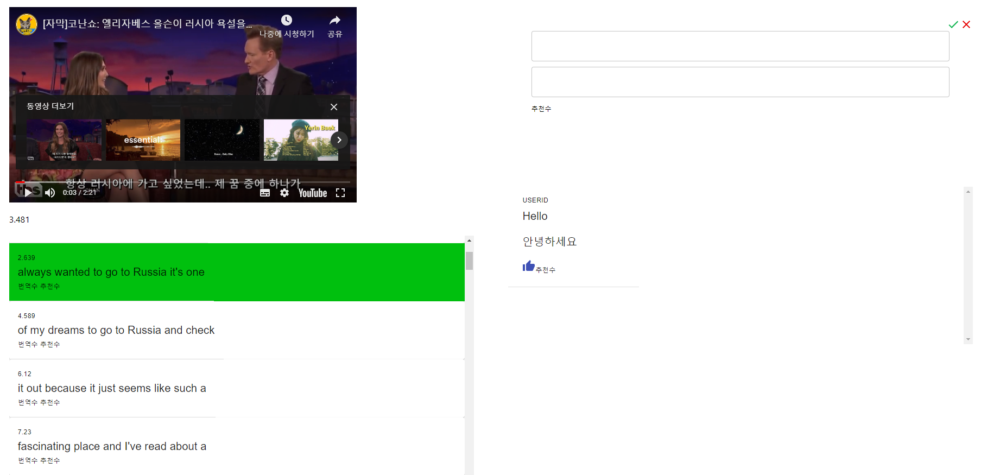
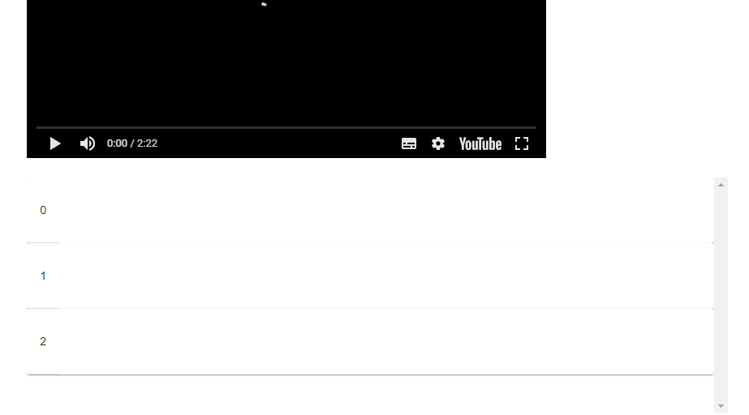

# React 특정 Table Row highlighting

Created By: 성희 배
Last Edited: Jan 27, 2020 6:30 PM
Tags: dev

### 전체 뷰



- Youtube 동영상 밑에 있는 Table의 Row를 클릭 시에 Highlighting 하는 기능을 설명한다.
- 다른 Row 클릭 시 클릭된 Row만 highlighting 된다.

---

### Table 선언

Translate.js
```javascript
    import RawItem from '../components/RawItem'
    <Table>
    	<TableBody>
    		<TableRow>
    			<RawItem/>
    		</TableRow>
    	</TableBody>
    </Table>
```
### TableCell Component 선언

RawItem.js
```javascript
    <TableCell>
    	<div>
    		<Typography variant='caption'></Typography>
    		<Typography variant='h6'></Typography>
    	</div>
    </TableCell>
```
- Row와 Row 안에 들어갈 Cell의 컴포넌트들을 만들어준다.

### 테이블 데이터 선언

Translate.js
```javascript
    const tableData = [1, 2, 3]
    return tableData.map((elem, index) => {
    <Table>
    	<TableBody>
    		<TableRow>
    			<RawItem/>
    		</TableRow>
    	</TableBody>
    </Table>
    )
    })
```
- 테이블 데이터를 대충 설정 해 주고, .map 반복문으로 Row를 생성해준다.
- 프로젝트를 실행 해 보면 3개의 cell들이 보일 것이다.

Translate.js
```javascript
    const tableData = [1, 2, 3]
    return tableData.map((elem, index) => {
    <Table>
    	<TableBody>
    		<TableRow>
    			<RawItem row={index}/>
    		</TableRow>
    	</TableBody>
    </Table>
    )
    })
```
- 그리고 map을 돌면서, row = {index}로 각각의 cell들의 index를 자식에게 보내준다.

### 부모에게 클릭된 cell의 index 보내기

RawItem.js
```javascript
    <TableCell>
    	<div>
    		<p>{this.props.row}</p>
    		<Typography variant='caption'></Typography>
    		<Typography variant='h6'></Typography>
    	</div>
    </TableCell>
```
- 이제 부모에게서 받은 값을 props로 접근할 수 있다.
- <p>태그로 한 번 찍어보겠다!



- 인덱스를 잘 받아온 것을 알 수 있다.
- 이제 이 cell들을 클릭 시, 부모에게 클릭 한 cell의 인덱스를 보내 줄 것이다.

    sendSelectedRow = () => {
    	this.props.parentCallback(this.props.row)
    }

- callback 형식으로 부모에게 클릭 한 값을 보내주는 메소드다.

RawItem.js
```javascript
    <TableCell onClick={this.sendSelectedRow}>
    	<div>
    		<p>{this.props.row}</p>
    		<Typography variant='caption'></Typography>
    		<Typography variant='h6'></Typography>
    	</div>
    </TableCell>
```
- TableCell의 onClick에 붙여준다.

### Parent에서 값을 받고 변경시키기

Translate.js
```javascript
    state = {
    	selected: null
    }
```
- Parent에서 state를 선언해준다
- 선택된 cell의 인덱스를 저장해주는 state이다
```javascript
    callbackFunc = (childData) => {
    	this.setState({ 
    		selected: childData,
    	})        
    }
```
- callback 함수를 선언 해 준다.
- setState로 RawItem.js에서 클릭 시 전달해준 index를 저장한다.
```javascript
    const tableData = [1, 2, 3]
    return tableData.map((elem, index) => {
    <Table>
    	<TableBody>
    		<TableRow>
    			<RawItem row={index} parentCallback={this.callbackFunc}/>
    		</TableRow>
    	</TableBody>
    </Table>
    )
    })
```
- RawItem에 callback 함수를 붙여준다.

- 이제 Raw Item을 클릭 → RawItem에서 클릭된 인덱스를 보낸다

### 클릭된 Cell을 색칠하기

Translate.js
```javascript
    const tableData = [1, 2, 3]
    return tableData.map((elem, index) => {
    <Table>
    	<TableBody>
    		<TableRow bgcolor={this.state.selected == index ? {color : `rgb(0, 40, 180)`} : null}>
    			<RawItem row={index} parentCallback={this.callbackFunc}/>
    		</TableRow>
    	</TableBody>
    </Table>
    )
    })
```
- 이제 클릭 할 때마다, state에 저장된(자식이 준 index)와 cell의 index가 같을 때만 칠해준다.
- 즉, 클릭 한 cell만 색이 칠해지는 것이다!

---

### 전체 소스코드

Translate.js
```javascript
    import React, { Component } from 'react'
    import { Paper, Table, TableRow, TableBody, withStyles } from '@material-ui/core'
    import RawItem from '../components/RawItem'
    
    class Translate extends Component {    
        state = {
            selected: null
        }
        
        callbackFunc = (childData) => {
            this.setState({ 
                selected: childData,
            })
        }
    
        render() {
            const {classes} = this.props
            const tableData = [1, 2, 3]
            return tableData.map((elem, index) => {
                return (
                    <div>
                        <Paper>
                            <Table>
                                <TableBody>
                                    <TableRow bgcolor={this.state.selected == index ? {color : `rgb(0, 40, 180)`} : null}>
                                    <RawItem parentCallback={this.callbackFunc} row={index}/>
                                    </TableRow>
    
                                </TableBody>
                            </Table>
                        </Paper>
                    </div>
                )
            })
        }
    
    }
    
    export default withStyles(styles)(RawBlock)
```
RawItem.js
```javascript
    import React, { Component } from 'react'
    import { Typography, TableCell } from '@material-ui/core'
    import { withStyles } from '@material-ui/core/styles'
    
    class RawItem extends Component {
    
        sendSelectedRow = () => {
            this.props.parentCallback(this.props.row)
        }
    
        render() {
            const { classes } = this.props
            const sub = this.props.data
            return (
                <div>
                    <TableCell onClick={this.sendSelectedRow}>
                        <div>
                            <p>{this.props.row}</p>
                            <Typography variant='caption'></Typography>
                            <Typography variant='h6'></Typography>
                        </div>
                    </TableCell>
    
                </div>
            )
    
    
        }
    
    
    }
    
    export default withStyles(styles)(RawItem)
```
- 리액트 재밌다
- 더 좋은 방법 있으면 알려주세요 :)